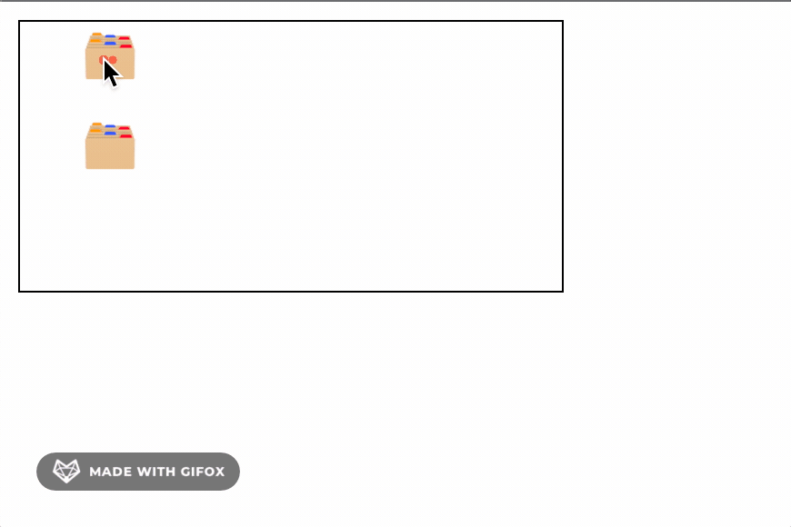

# drag-n-drop
I was interested in creating a drag and drop interface in the browser. I started by reading documentation for the [HTML Drag and Drop API](https://developer.mozilla.org/en-US/docs/Web/API/HTML_Drag_and_Drop_API), but settled on just using event listeners for different mouse events.

For slightly improved performance, while still maintaining a smooth "animation" on drag, I've debounced the event slightly (150ms).

This is what the finished product looks like:

